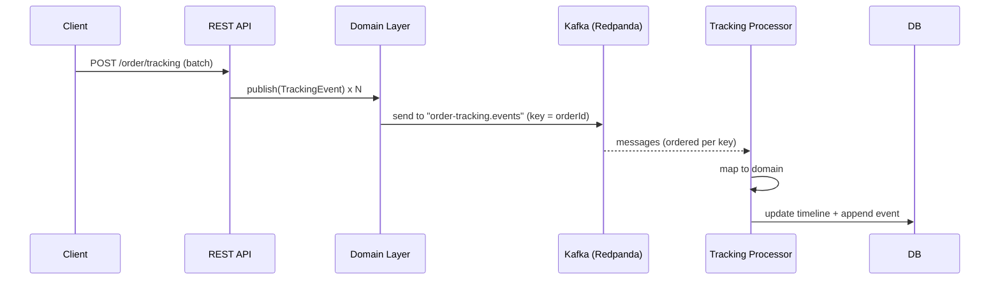

I’ve been thinking about how to keep evolving my [order-tracking](https://github.com/egobb/order-tracking) project
, and once the basic functional records were in place, the next natural step was to ensure a minimal yet solid scalability layer. After all, what’s the point of a clean domain model if it can’t handle growth? And what better way to achieve that than by moving to an event-driven architecture with Kafka. That shift allowed me to decouple ingestion from processing, improve throughput, and prepare the service for future enhancements without locking myself into synchronous bottlenecks.

## The problem we were solving

Originally, the service exposed a REST endpoint that **synchronously** inserted tracking events into the database (one or many per POST). That ties request latency to DB work and caps horizontal scalability.

The goal: **decouple ingestion from processing** so the REST layer stays thin and we can scale processing independently. Enter **domain events + Kafka**.

## Why Redpanda for Kafka?

I wanted the **Kafka API** without the operational overhead for local/dev and small deployments. **Redpanda** speaks the **Kafka protocol** (drop-in compatible with Kafka clients) and ships as a **single binary**, which makes **Docker Compose** setups trivial and fast. That let me focus on the app’s design instead of babysitting infra.

> Same Kafka clients, simpler ops for local/dev; we can move to managed Kafka later with zero code changes.

## The design (DDD/Hexagonal)

At a high level:



Key ideas:
- **Domain emits events**, infra publishes them to a **private Kafka topic** (`order-tracking.events`). We use **orderId as the key** to preserve **ordering per order**.
- A **Kafka consumer** (with `concurrency = "6"`) **maps the message back to domain** and runs the **same** processing path that previously ran synchronously.
- The REST endpoint answers **202 Accepted** immediately; the heavy lifting happens asynchronously.

## Code walk-through

### 1) Domain event

```java
// app/src/main/java/com/egobb/orders/domain/event/TrackingEvent.java
public record TrackingEvent(String orderId, Status status, Instant eventTs)
    implements DomainEvent {}
```

Simple, immutable, and serializable.

### 2) Publishing via a domain event handler (infra)

```java
// application port
public interface PublishDomainEventPort {
  void publish(DomainEvent event);
}
```

…and implement it in infrastructure, listening to domain events and publishing to Kafka:

```java
@Component
@RequiredArgsConstructor
public class TrackingEventDomainHandler implements PublishDomainEventPort {
  private final TrackingEventPublisher publisher;

  @Override
  public void publish(DomainEvent event) { this.onDomainEvent(event); }

  @EventListener
  public void onDomainEvent(DomainEvent event) {
    if (event instanceof TrackingEvent ev) {
      final var msg = TrackingEventMapper.toMsg(ev);
		this.publisher.publish(ev.orderId(), msg); // key = orderId
    }
  }
}
```

This keeps domain clean and places Kafka concerns in infrastructure. The key = orderId ensures per-order ordering within a partition.

### 3) Message mapping

```java
public class TrackingEventMapper {
  public record TrackingEventMsg(String orderId, String status, Instant eventTs, String schemaVersion) {}
  public static TrackingEventMsg toMsg(TrackingEvent ev) {
    return new TrackingEventMsg(ev.orderId(), ev.status().toString(), ev.eventTs(), "v1");
  }
  public static TrackingEvent toDomain(TrackingEventMsg msg) {
    return new TrackingEvent(msg.orderId(), Status.fromString(msg.status()), msg.eventTs());
  }
}
```

A tiny **wire model** decoupled from domain and **versioned** (`schemaVersion = "v1"`).

### 4) The Kafka producer

```java
@Component
@RequiredArgsConstructor
public class TrackingEventPublisher {
  private final KafkaTemplate<String, TrackingEventMapper.TrackingEventMsg> template;

  public void publish(String key, TrackingEventMapper.TrackingEventMsg msg) {
	  this.template.send(KafkaTopics.TRACKING_EVENTS, key, msg);
  }
}
```

The topic constant:

### 5) The Kafka consumer

```java
@Slf4j
@Component
@RequiredArgsConstructor
public class TrackingEventListener {
  private final TrackingProcessor processor;

  @KafkaListener(
    topics = KafkaTopics.TRACKING_EVENTS,
    groupId = "order-tracking-processor",
    concurrency = "6")
  public void onMessage(TrackingEventMapper.TrackingEventMsg msg) {
    log.info(">>> Consumed from Kafka: {}", msg);
    final var domain = TrackingEventMapper.toDomain(msg);
	  this.processor.processOne(domain);
  }
}
```

- concurrency = "6" → runs multiple consumers in parallel within the same process.
- The groupId is also aligned in application.yml.


### 6) The REST endpoint (now asynchronous)

```java
@RestController
@RequestMapping(path = "/order/tracking")
@RequiredArgsConstructor
public class TrackingController {
  private final ProcessTrackingUseCase useCase;

  @PostMapping(consumes = {MediaType.APPLICATION_JSON_VALUE, MediaType.APPLICATION_XML_VALUE})
  public ResponseEntity<Void> ingest(@Valid @RequestBody TrackingEventsDTO body) {
    final var events = body.event().stream().map(this::toDomain).toList();
	  this.useCase.ingestBatch(events);
    return ResponseEntity.accepted().build(); // 202
  }
}
```

**Why 202?** Because actual processing is **asynchronous** behind Kafka.

### 7) Processing logic is unchanged (by design)

```java
public void processOne(TrackingEvent e) {
  final var maybe = repository.findById(e.orderId());
  final var tl = maybe.orElse(new OrderTimeline(e.orderId(), null, null));
  if (!sm.canTransition(tl.lastStatus(), e.status())) return;
  tl.apply(e.status(), e.eventTs());
  repository.save(tl);
  appender.append(e);
}
```

The consumer reuses the exact same domain logic you had before; we only changed how events get there.

## Kafka/Redpanda configuration

```yaml
spring:
  kafka:
    bootstrap-servers: localhost:19092
    producer:
      acks: all
      retries: 10
      properties:
        enable.idempotence: true
      key-serializer: org.apache.kafka.common.serialization.StringSerializer
      value-serializer: org.springframework.kafka.support.serializer.JsonSerializer
    consumer:
      group-id: order-tracking-processor
      auto-offset-reset: latest
      properties:
        isolation.level: read_committed
      key-deserializer: org.apache.kafka.common.serialization.StringDeserializer
      value-deserializer: org.springframework.kafka.support.serializer.JsonDeserializer
    listener:
      ack-mode: RECORD
```

- Idempotent producer + acks=all + retries for safe delivery.
- Read committed on the consumer to avoid ver messages no confirmados.
- Default bootstrap en 19092 (mapeado por Compose).

> Redpanda’s Docker Compose quickstarts make exposing a single broker + Console straightforward; this project uses that style of layout for local dev

## Running it locally

1) Start infra:

```bash
make up   # boots Postgres + Adminer + Redpanda (Kafka API)
```

2) POST a batch:

```bash
curl -X POST http://localhost:8080/order/tracking   -H 'Content-Type: application/json'   -d '{
        "event": [
          {"orderId":"A-1","status":"PLACED","eventTs":"2025-09-22T08:00:00Z"},
          {"orderId":"A-1","status":"SHIPPED","eventTs":"2025-09-22T10:00:00Z"},
          {"orderId":"B-7","status":"PLACED","eventTs":"2025-09-22T09:00:00Z"}
        ]
      }'
```

3) Watch the consumer logs and inspect the DB/Adminer.

(Tip: Document in your README the Redpanda Console URL if you expose it in Compose.)

## Integration testing

- The project includes Testcontainers Kafka dependency and integration tests (OrderTrackingIntegrationTest, RestIntegrationTest). These validate that a POST triggers a domain event, the event is published/consumed, and the timeline & event append are persisted.

### What to test (ideas):

- Ordering per key: two events for the same orderId should be processed in order.
- At-least-once processing: duplicate deliveries don’t corrupt the timeline (consider idempotency constraints).
- Versioning: messages with schemaVersion="v1" still map cleanly; unknown versions go to DLT.

## Why the domain event handler pattern?

- **Separation of concerns**: HTTP → Application → Domain emits intent. Infra decides **how** that intent is transported.
- **Testability**: Domain remains POJO/record-centric; transport is mocked in unit tests and exercised in integration tests.
- **Evolvability**: Adding DLT, retry, observability, or switching brokers stays in infra.

## Why a private Kafka topic?

- It’s an **internal contract**. We can evolve schema/versioning without breaking external consumers.
- Using **key = orderId** guarantees **ordering** where it matters (per order).

## Next steps

- Dead-letter topic (DLT) and retry/backoff policy.
- Functional metrics at invalid state transitions.
- Idempotency at DB level.
- More partitions + consumer autoscaling.
- CQRS with Command pattern.
- Event contracts API-first.
- Schema Registry for moving to Avro.

---
