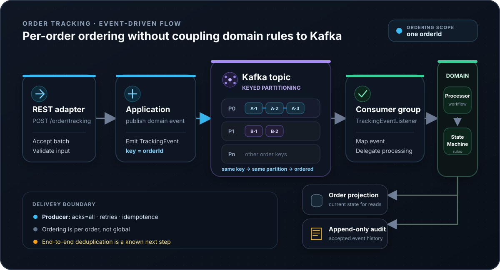

Order tracking looks simple until the ingestion path has to accept bursts of updates without making request latency depend on database work, while still applying events for each order in the correct sequence. The original version of this project processed tracking updates synchronously from HTTP into persistence. That was easy to reason about, but it coupled request handling to downstream processing and made independent scaling difficult.

The constraints mattered more than the choice of broker:

- events for **one order must be processed in order**;
- unrelated orders should still be able to progress in parallel;
- domain transition rules should not depend on HTTP, Kafka, or PostgreSQL;
- the system should keep both an **audit history** and a **read-oriented projection**;
- asynchronous delivery introduces retries, redelivery, lag, and failure modes that need to be made explicit rather than hidden behind "Kafka".

The resulting design moves ingestion behind Kafka, but keeps the processing model deliberately small: HTTP accepts a batch, application code emits one domain event per item, infrastructure publishes each event using `orderId` as the Kafka key, and a consumer maps the wire message back into the domain before updating persistence.

## Event flow and ordering boundary

<picture>
  <source media="(max-width: 640px)" srcset="order-tracking-architecture-mobile.svg">
  
</picture>

*Keyed partitioning keeps events for one order on the same Kafka partition while unrelated orders can progress in parallel.*

The important guarantee is **per-order ordering, not global ordering**. [`TrackingEventDomainHandler`](https://github.com/egobb/order-tracking/blob/main/app/src/main/java/com/egobb/orders/infrastructure/kafka/TrackingEventDomainHandler.java) passes `ev.orderId()` as the publication key, and [`TrackingEventPublisher`](https://github.com/egobb/order-tracking/blob/main/app/src/main/java/com/egobb/orders/infrastructure/kafka/TrackingEventPublisher.java) sends that key with the Kafka record. Kafka routes records with the same key to the same partition, so records for one order share a partition and retain that partition's order. Different order IDs can land on different partitions and therefore be processed concurrently.

That boundary is deliberate. The system does **not** promise ordering between different orders, and adding consumer concurrency does not make one hot order parallel: a single key remains constrained by the throughput of its partition. The current [`OrderTrackingIntegrationTest`](https://github.com/egobb/order-tracking/blob/main/app/src/test/java/com/egobb/orders/integration/OrderTrackingIntegrationTest.java) exercises the REST → Kafka → processor path with multiple orders and verifies that the observed events remain ordered within each order. A more isolated partition-level demonstration is still useful future evidence rather than something I claim as already complete.

## Evolving the synchronous design instead of replacing the domain

The migration changed **how work reaches the processor**, not the business rules themselves.

[`TrackingApplicationService`](https://github.com/egobb/order-tracking/blob/main/app/src/main/java/com/egobb/orders/application/service/TrackingApplicationService.java) depends on an application output port and publishes domain events after validating required input fields. Kafka-specific code lives behind that port. On the other side, [`TrackingEventListener`](https://github.com/egobb/order-tracking/blob/main/app/src/main/java/com/egobb/orders/infrastructure/kafka/TrackingEventListener.java) converts the wire message back to a domain event and delegates to [`TrackingProcessor`](https://github.com/egobb/order-tracking/blob/main/app/src/main/java/com/egobb/orders/application/service/TrackingProcessor.java).

The processor then performs the same core workflow regardless of transport:

1. load the current `OrderTimeline` projection;
2. validate the requested transition through the domain `StateMachine`;
3. update the projection when the transition is valid;
4. append the accepted event to the audit history.

The transition rules themselves live in [`StateMachine`](https://github.com/egobb/order-tracking/blob/main/app/src/main/java/com/egobb/orders/domain/service/StateMachine.java), which has no Kafka, Spring MVC, or persistence dependency. [`StateMachineTest`](https://github.com/egobb/order-tracking/blob/main/app/src/test/java/com/egobb/orders/domain/StateMachineTest.java) verifies examples such as `DELIVERED` being terminal and preventing a transition back to the initial state.

This is the main reason I kept the DDD/hexagonal boundary during the Kafka migration: asynchronous infrastructure can change without rewriting the rules that decide whether an order event is valid.

## Delivery guarantees: what the configuration does and does not prove

The Kafka producer is configured in [`application.yml`](https://github.com/egobb/order-tracking/blob/main/app/src/main/resources/application.yml) with `acks: all`, retries, and `enable.idempotence: true`. Those settings reduce the risk of duplicate records caused by producer retries and require acknowledgement from the in-sync replicas according to Kafka's producer semantics.

They do **not** make the complete business flow exactly-once.

The current application does not expose an explicit event identity used for database deduplication, nor does the code show one transaction spanning Kafka consumption, projection persistence, audit persistence, and offset advancement. If a record is redelivered after a partial failure, the consumer can therefore attempt the database work again. End-to-end duplicate handling remains a known gap and is intentionally tracked as future work rather than described here as solved.

There is another explicit failure boundary in [`TrackingProcessor`](https://github.com/egobb/order-tracking/blob/main/app/src/main/java/com/egobb/orders/application/service/TrackingProcessor.java): an invalid transition currently returns without applying the event, with a TODO for functional metrics. That protects the projection from an illegal transition, but it is not yet a complete operational policy for rejected events. A production-hardened version would make rejection visibility, dead-letter handling, retry classification, and replay safety first-class concerns.

### Failure modes I would design for next

**Producer retry.** The current boundary is an idempotent Kafka producer with `acks=all` and configured retries. The next step would be to monitor send failures and delivery latency and define explicit retry-exhaustion behavior.

**Consumer or process crash.** A Kafka record can be redelivered depending on offset state. The next step is durable event identity plus database-level deduplication so a redelivery cannot duplicate business effects.

**Invalid state transition.** Domain processing currently ignores the event after validation rejects it. The next step is explicit rejection metrics and logs plus a deliberate review or dead-letter policy.

**Database unavailable or slow.** Kafka decouples request acceptance from processing, but downstream work can accumulate. The next step is alerting on consumer lag and database errors with bounded retry and backoff behavior.

**Poison or incompatible message.** A mapping or processing exception currently reaches the listener boundary. The next step is deliberate schema-version handling and separate routing for recoverable and non-recoverable failures.

**Replay or backfill.** There is no dedicated safe replay path yet. Before enabling one, I would isolate replay identity and scope and add validation plus idempotent persistence.

## Testing evidence

The project has two useful evidence layers today.

**Domain tests** exercise transition behavior without infrastructure. This keeps the business rules fast to test and makes failures easy to localize.

**Integration coverage** uses a Kafka Testcontainer and a real Spring Boot HTTP endpoint. [`OrderTrackingIntegrationTest`](https://github.com/egobb/order-tracking/blob/main/app/src/test/java/com/egobb/orders/integration/OrderTrackingIntegrationTest.java) submits a batch, waits for Kafka consumption, captures the domain events received by the processor, and checks per-order ordering. This demonstrates the asynchronous hand-off through Kafka without claiming more than the test actually covers.

The repository README currently documents broader local infrastructure, including PostgreSQL and Kafka through Docker Compose. A separately tracked roadmap item is intended to verify the complete clean-checkout path and tighten those instructions; until that is finished, I treat the source and existing automated tests as stronger evidence than an unverified setup claim.

## Operational surface

The application exposes Spring Boot Actuator health/metrics endpoints and a Prometheus endpoint through the current configuration. Kafka consumer logs also expose processing activity. Those are useful foundations, but the operational story is deliberately incomplete: there is no published benchmark, SLO, consumer-lag dashboard, or incident runbook attached to this portfolio project yet.

For an operational deployment I would monitor at least:

- consumer lag by topic/partition and consumer group;
- event processing success/rejection/error rates;
- producer send failures and retry rates;
- database latency, pool saturation, and persistence errors;
- age of the oldest unprocessed event;
- rate of duplicate detections once an event identity is introduced.

Any thresholds shown in future dashboards should be labelled as portfolio assumptions or reproduced measurements, not presented as production evidence without data.

## AWS deployment: production-like, not production

The repository includes Terraform for a portfolio/preproduction-style AWS environment. [`infra/README.md`](https://github.com/egobb/order-tracking/blob/main/infra/README.md) documents ECS Fargate for the application, ECR for images, an ALB, MSK Serverless, RDS PostgreSQL, Secrets Manager, CloudWatch Logs, remote Terraform state, and GitHub OIDC-based deployment roles.

That infrastructure is intentionally cost-aware and **not a production topology**. The documentation calls out concessions such as simplified networking and small development capacity, and includes a hardening path for private subnets, tighter IAM, stronger database protection, HTTPS, logging, and other controls. I use it as evidence that the service can be described and provisioned beyond localhost—not as evidence of real production scale or availability.

## Trade-offs

Moving ingestion behind Kafka buys a useful separation of concerns: request acceptance is no longer tied to the duration of domain processing or database writes, and consumers can scale independently across partitions. It also introduces operational complexity that the synchronous version did not have: broker availability, lag, rebalances, redelivery, schema compatibility, and replay policy all become part of the system design.

Keyed partitioning is similarly a trade-off rather than a free scalability feature. It gives a simple, strong ordering boundary for one order, but it means a disproportionately hot order cannot be processed concurrently without changing the domain's ordering model. That is acceptable here because correctness per aggregate is more important than maximizing parallelism for a single aggregate.

Keeping the domain processor independent from Kafka costs a little extra mapping and port/adaptor structure, but it made the migration incremental and keeps future transport or persistence changes from leaking into transition rules.

## What I would improve next

The next useful improvements are evidence-driven rather than adding more technology:

1. verify a clean-checkout local path and make the observable persisted result explicit;
2. add database-level event identity and duplicate/idempotency tests;
3. produce one canonical architecture asset shared by the repository and this case study;
4. capture a short request → Kafka → persisted-result demo;
5. add a safe replay lab that distinguishes retry, redelivery, replay, and backfill;
6. add a reproducible performance baseline before publishing throughput claims;
7. turn the existing metrics endpoints into a small operational dashboard and runbook.

Those items are intentionally not presented as completed capabilities here.

## Source and deeper implementation notes

- [Order Tracking source repository](https://github.com/egobb/order-tracking)
- [Kafka migration engineering write-up](/posts/scaling-order-tracking-with-kafka-domain-events-and-auto-ingestion/)

The article walks through the original migration and code in more detail. This page is the shorter case-study view: the problem, architectural decisions, evidence, limitations, and the trade-offs I would defend in an interview.
