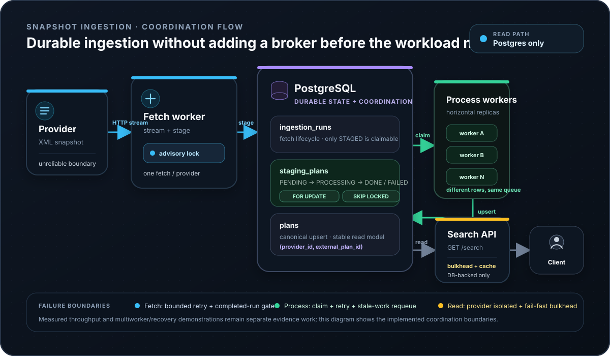

A snapshot provider is an awkward system boundary. The payload can be large, the network can fail, malformed records can appear halfway through the document, and a processing worker can disappear after claiming work. None of those failure modes should become `/search` latency or availability problems.

This project separates that unreliable ingestion boundary from the stable read path. A fetch worker streams the provider XML into durable staging rows, process workers claim completed work in PostgreSQL, and the API serves canonical data from PostgreSQL only. The interesting decision is not that PostgreSQL *can* coordinate the pipeline. It is deciding that, for this workload, introducing Kafka would add more operational machinery than the problem currently earns.

The constraints are explicit:

- `/search` must not call the external provider at request time;
- large XML snapshots should be parsed as a stream rather than loaded into memory as one object graph;
- a failed or partial fetch must not become processable data;
- multiple processing workers should be able to share the backlog without a central worker lock;
- concurrent fetch schedulers must not duplicate the same provider fetch;
- retries and worker crashes need visible recovery state;
- repeated or older snapshots must not overwrite newer canonical state incorrectly;
- the design should stay small until throughput, fan-out, replay, or event-stream requirements justify a broker.

## Architecture and coordination boundaries

<picture>
  <source media="(max-width: 640px)" srcset="snapshot-ingestion-architecture-mobile.svg">
  
</picture>

*Two different PostgreSQL primitives solve two different coordination problems: advisory locks serialize provider fetches, while `SKIP LOCKED` partitions staged work across processing workers.*

The runtime uses one application image in three modes: `worker-fetch`, `worker-process`, and `api`. The shared database is both the durable hand-off and the operational state store. That keeps the architecture compact while preserving independent scaling boundaries.

The API never crosses the provider boundary. [`PlanPostgresAdapter`](https://github.com/egobb/plan-service/blob/main/app/src/main/java/com/egobb/plan/service/infrastructure/persistence/postgres/PlanPostgresAdapter.java) implements the read path directly against `plans`, so provider latency and provider outages are outside the request path. A small cache in [`PlanBetweenDatesQueryHandler`](https://github.com/egobb/plan-service/blob/main/app/src/main/java/com/egobb/plan/service/application/command/handler/PlanBetweenDatesQueryHandler.java) only caches bounded first-page hot ranges; PostgreSQL remains the source of truth.

## Why PostgreSQL instead of Kafka

Kafka would be a reasonable choice if this were a continuous event stream, if multiple independent consumers needed replayable history, or if the ingestion rate required partitioned broker throughput. Those are not the current constraints.

The provider exposes a **periodic snapshot**. The service already needs PostgreSQL for canonical plans and historical reads. Staging that snapshot in the same database gives the pipeline durability, inspectable backlog state, transactional row claiming, retry metadata, and recovery state without introducing another distributed system.

That decision removes several things from the operational surface: broker provisioning, topic lifecycle, consumer-group behavior, offset management, schema evolution across a log, and replay policy. It also gives up things Kafka is better at. PostgreSQL becomes the shared serving-and-ingestion bottleneck, database connection budgets matter, fan-out is poor, and there is no append-only event log to replay independently.

So the decision is intentionally conditional: **PostgreSQL is sufficient while the workload remains a bounded snapshot pipeline with one main processing path and manageable database contention.** If measurements later show sustained queue contention, much larger fan-out, independent consumers, or replay-heavy requirements, the boundary should be revisited rather than defended ideologically.

## Staging creates the reliability checkpoint

The fetch worker does not write canonical plans directly. It creates an ingestion run and stages parsed rows first. Only when the snapshot has completed successfully does that run become eligible for processing.

That rule is encoded in [`StagingPlanPostgresRepository`](https://github.com/egobb/plan-service/blob/main/app/src/main/java/com/egobb/plan/service/infrastructure/persistence/postgres/ingest/StagingPlanPostgresRepository.java). A process worker can claim a row only when:

- the staging row is `PENDING`;
- it has not exhausted its attempts;
- its parent ingestion run is `STAGED`.

The important part is the last condition. If the fetch worker fails halfway through a document, already-inserted staging rows do not silently become a partial canonical snapshot. The processing side waits for an explicit completed-run state instead of inferring completeness from timing or row counts. [`StagingClaimGatingByRunStatusIT`](https://github.com/egobb/plan-service/blob/main/app/src/test/java/com/egobb/plan/service/integration/StagingClaimGatingByRunStatusIT.java) is repository evidence for that gating rule.

This is one reason I prefer the staging boundary to a direct fetch-and-upsert loop: it turns an unreliable external operation into durable, queryable internal state before business data is changed.

## Streaming XML instead of building the whole snapshot in memory

[`ProviderAdapter`](https://github.com/egobb/plan-service/blob/main/app/src/main/java/com/egobb/plan/service/infrastructure/rest/adapter/provider/ProviderAdapter.java) passes the provider HTTP response body directly to [`ProviderXmlStreamParser`](https://github.com/egobb/plan-service/blob/main/app/src/main/java/com/egobb/plan/service/infrastructure/rest/adapter/provider/xml/ProviderXmlStreamParser.java). The parser uses StAX `XMLStreamReader` and emits each parsed plan to a consumer as the stream advances.

That design avoids requiring one in-memory representation of the complete snapshot. It also lets malformed individual plans be skipped defensively while the parser continues through the document. The parser disables DTD and external-entity support as a basic XML hardening measure, and [`ProviderXmlStreamParserTest`](https://github.com/egobb/plan-service/blob/main/app/src/test/java/com/egobb/plan/service/infrastructure/rest/adapter/provider/xml/ProviderXmlStreamParserTest.java) covers parser behavior.

What I do **not** claim yet is a measured peak-memory improvement. Streaming is visible in the implementation, but the roadmap benchmark is still needed before publishing memory numbers or throughput claims.

## Two coordination problems, two PostgreSQL mechanisms

There are two very different kinds of duplicate work in this pipeline, and using one global locking mechanism for both would reduce scalability unnecessarily.

### Fetch coordination: one active fetch per provider

If multiple fetch schedulers are running, the same provider snapshot should not be fetched and staged concurrently by each replica. [`PostgresAdvisoryLockService`](https://github.com/egobb/plan-service/blob/main/app/src/main/java/com/egobb/plan/service/infrastructure/lock/PostgresAdvisoryLockService.java) uses `pg_try_advisory_lock` with a stable per-provider lock name. The JDBC connection stays open for the whole critical section because PostgreSQL advisory locks are session-scoped.

This is deliberately **coarse coordination**: one provider fetch at a time. It prevents duplicate snapshot acquisition without putting a distributed lock around unrelated providers or around the processing backlog.

### Processing coordination: many workers, different rows

Process workers need the opposite behavior. They should run concurrently, but they should not process the same staging row at the same time.

[`StagingPlanPostgresRepository`](https://github.com/egobb/plan-service/blob/main/app/src/main/java/com/egobb/plan/service/infrastructure/persistence/postgres/ingest/StagingPlanPostgresRepository.java) claims eligible IDs inside a transaction using `FOR UPDATE OF sp SKIP LOCKED`, marks those rows `PROCESSING`, and records `claimed_at`. Rows locked by one worker are skipped by another worker, so workers naturally receive different batches without a process-wide distributed lock.

That code is strong qualitative evidence of the concurrency design. A dedicated repeated multiworker contention test is still tracked separately, so I do not present a measured "no duplicates under N workers" result here yet.

## Retry and recovery are explicit state transitions

The provider client has bounded retry behavior rather than an unbounded loop. [`ProviderAdapter`](https://github.com/egobb/plan-service/blob/main/app/src/main/java/com/egobb/plan/service/infrastructure/rest/adapter/provider/ProviderAdapter.java) applies configurable attempts, exponential backoff with optional jitter, avoids retrying ordinary non-429 `4xx` responses, and can treat parse errors differently from transport failures.

On the processing side, failed staging rows increment an attempt counter and either return to `PENDING` or become terminal `FAILED` after the configured maximum. That makes retry state visible in the database instead of hiding it in an in-memory executor.

The other important failure mode is a worker crash **after** claiming rows. Claimed rows have `status = PROCESSING` and a `claimed_at` timestamp. [`RequeueStuckStagedPlansScheduled`](https://github.com/egobb/plan-service/blob/main/app/src/main/java/com/egobb/plan/service/infrastructure/scheduled/RequeueStuckStagedPlansScheduled.java) invokes repository logic that moves sufficiently old `PROCESSING` rows back to `PENDING` so another worker can retry them.

The mechanism exists in the current code. A dedicated crash/requeue integration scenario is still part of the planned evidence work, so this page distinguishes implementation evidence from a future reproducible failure demonstration.

## Idempotent canonical writes and stale-snapshot protection

The canonical table is not append-only. Reprocessing a logical plan needs to converge on the same row rather than create another one.

[`PlanPostgresAdapter`](https://github.com/egobb/plan-service/blob/main/app/src/main/java/com/egobb/plan/service/infrastructure/persistence/postgres/PlanPostgresAdapter.java) upserts on the composite identity `(provider_id, external_plan_id)`. Its conflict update also compares `last_seen_at`, so an older snapshot cannot overwrite newer title, date, price, or sell-mode values. `ever_online` is monotonic: once true, it stays true.

That gives retries and out-of-order snapshot completion a safer persistence boundary. It is still important to be precise about the claim: the code implements idempotent-style upsert semantics for canonical plan identity; the separate roadmap test will make repeat-ingestion behavior explicit under a reproducible scenario.

## Protecting the stable read path

Moving provider access out of `/search` prevents one class of instability, but database saturation can still hurt the API. [`SearchBulkheadExecutor`](https://github.com/egobb/plan-service/blob/main/app/src/main/java/com/egobb/plan/service/contract/resilience/SearchBulkheadExecutor.java) wraps search execution with a Resilience4j bulkhead. When the configured concurrent-call limit is exhausted, the API fails fast with `503` instead of allowing unbounded request concurrency to consume the database pool.

The cache is intentionally narrow rather than a second source of truth. [`PlanBetweenDatesQueryHandler`](https://github.com/egobb/plan-service/blob/main/app/src/main/java/com/egobb/plan/service/application/command/handler/PlanBetweenDatesQueryHandler.java) caches only selected first-page queries and skips empty results. The underlying repository remains PostgreSQL, so cache loss changes performance, not correctness.

This is another trade-off: the bulkhead can reject valid traffic under saturation. That is preferable to letting every caller wait behind an exhausted database pool, but the correct limit should ultimately come from measured database and latency behavior rather than from a decorative configuration value.

## Observability: enough signals to operate, not an invented SLO

The application exposes Actuator health, metrics, and Prometheus endpoints. The repository records custom metrics for provider fetch outcomes and duration, staging inserts, processing success/failures, stale-row requeues, and bulkhead rejections.

Those signals map naturally to the pipeline's failure modes:

- provider failure rate and fetch duration indicate external-boundary health;
- age and volume of pending staging rows indicate ingestion lag;
- processing failures and retry counts expose bad data or downstream persistence problems;
- stale-row requeues expose worker interruption or processing stalls;
- bulkhead rejects expose read-path pressure;
- database latency and pool usage bound both ingestion and serving capacity.

What is missing is equally important: this project does not yet publish a measured latency baseline, benchmark report, production SLO, or validated alert thresholds. Those should be derived from reproducible tests or labelled as illustrative later, not presented here as production facts.

## Evidence today vs. evidence still planned

**Directly visible in the repository today:**

- streaming provider HTTP + StAX XML parsing;
- completed-run gating before staged rows become claimable;
- per-provider PostgreSQL advisory locks;
- `FOR UPDATE SKIP LOCKED` worker claiming;
- retry metadata and stale-`PROCESSING` requeue logic;
- composite-key canonical upserts with stale-snapshot protection;
- database-only search path, bounded cache, and search bulkhead;
- Actuator/Prometheus plus domain-specific metrics.

**Still deliberately tracked as future evidence:**

- a reproducible throughput, latency, and memory benchmark;
- repeated multiworker contention evidence;
- an explicit parallel-fetch lock test;
- repeat-ingestion idempotency evidence;
- a worker-crash/requeue integration demonstration;
- a canonical cross-repository architecture asset and short demo.

The distinction matters. The architecture is inspectable now, but architecture reasoning is not the same thing as benchmark evidence.

## Trade-offs and the point where I would change the design

The current design optimizes for **operational simplicity and inspectability**. PostgreSQL already has to exist, and the queue state is queryable with normal SQL. That makes recovery and debugging straightforward for a bounded snapshot pipeline.

The cost is that the database carries several responsibilities at once: canonical reads, staging writes, row claiming, retry metadata, and coordination. Connection-pool sizing and transaction duration therefore matter more than they would if ingestion were isolated behind a dedicated broker. `SKIP LOCKED` also gives work distribution, not Kafka-style durable consumer offsets or replayable partitions.

I would introduce a broker when the problem changes enough to justify it: sustained ingestion pressure that competes materially with reads, multiple independent downstream consumers, long-lived replay requirements, very high fan-out, or a true continuous event stream. Until then, keeping the coordination inside PostgreSQL is a deliberate decision to avoid paying for architecture that the workload does not need.

## Source and deeper implementation notes

- [Snapshot Ingestion / Plan Service source repository](https://github.com/egobb/plan-service)
- [When Postgres Is Enough: engineering write-up](/posts/when-postgres-is-enough-building-a-resilient-snapshot-ingestion-pipeline-without-kafka/)

The article contains the longer implementation walkthrough and SQL examples. This case study is the interview-oriented view: the failure boundaries, why PostgreSQL is sufficient today, how concurrency and recovery are coordinated, what the code proves, and what still needs measured evidence.
